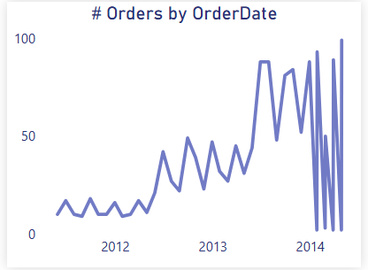
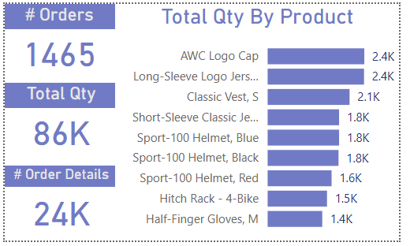
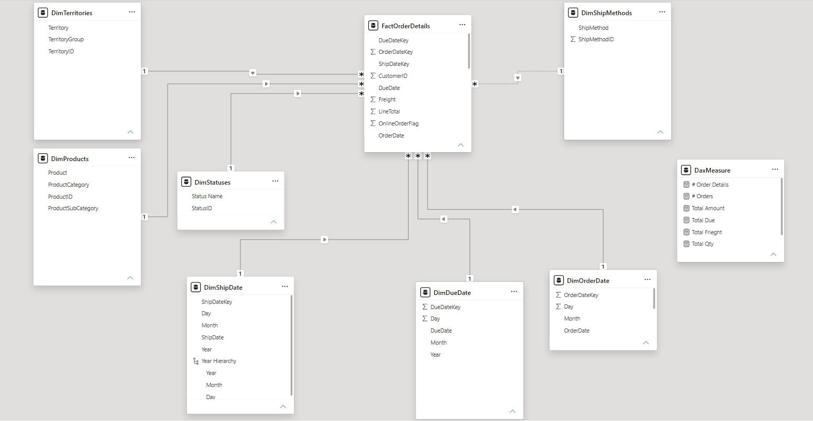

# Sales Analysis & Data Modeling Project

## Project Overview

This project presents a Power BI solution for analyzing sales and order data and transforming transactional business data into meaningful analytical insights.

The project covers sales performance, order activity, territories, order status, time-based trends, product quantities, and order details. It also includes the design of a structured Star Schema to organize the data and support analytical reporting.

The solution combines data analysis, interactive visualization, DAX-based calculations, and data modeling techniques to provide a clear view of business performance.

---

## Project Objectives

- Analyze overall sales and order performance.
- Monitor key sales and order metrics.
- Examine order activity across time and territories.
- Analyze order status and distribution.
- Explore product quantities and order details.
- Identify patterns and trends within the sales data.
- Build interactive Power BI dashboards.
- Design a structured data model using Star Schema principles.
- Prepare the data structure for analytical reporting.

---

## Skills Demonstrated

- Power BI
- DAX
- Data Analysis
- Data Visualization
- Data Modeling
- Star Schema
- Business Intelligence
- Analytical Reporting

---

# Analysis Workflow

The project follows a structured analytical workflow, moving from an overall view of business performance to detailed analysis and data modeling.

### 1. Sales & Order Performance

The analysis begins with a high-level overview of sales and order activity using key performance indicators.

The dashboard provides an overview of:

- Total Sales Amount
- Total Amount Due
- Total Tax
- Total Freight
- Number of Orders
- Number of Order Details

### Sales Overview Dashboard

---

### 2. Order Activity & Time Analysis

Order activity is analyzed over time to understand changes in order volume across different periods.

### Orders by Order Date

This analysis helps identify changes and patterns in order activity over time.

---

### 3. Product & Order Detail Analysis

The project also examines order detail information at the product level, including product quantities, categories, subcategories, unit prices, and line totals.

The analysis helps provide a more detailed view of product-level order activity.

### Sales Overview Tooltip

The interactive tooltip provides additional context while exploring the dashboard, including order volume, total quantity, order details, and product-level quantity information.

---

### 4. Business Questions

The analysis was designed to answer key business questions, including:

1. What is the total amount due?
2. What is the total sales amount?
3. How much total tax was collected?
4. What is the total freight cost?
5. How many orders were placed?
6. How many order details were recorded?
7. How do order volumes and total amounts vary across territories?
8. What is the distribution of orders by status?
9. How have the number of orders changed over time?
10. Which product categories have the highest number of order details?

---

# Data Structure

The analysis uses order-level and order-detail-level information.

### Orders Data

The order-level data contains information such as:

- Order ID
- Order Date
- Ship Date
- Due Date
- Status
- Territory
- Subtotal Amount
- Total Tax
- Total Freight
- Total Due
- Number of Order Details

### Order Details Data

The order-detail data provides more granular information, including:

- Order Detail ID
- Order ID
- Category
- Subcategory
- Product
- Order Quantity
- Unit Price
- Line Total

This structure allows the analysis to move from overall order performance to detailed product-level activity.

---

# Data Modeling

To support analytical reporting, the project includes a structured data model based on Star Schema principles.

### Star Schema

The model organizes transactional information around a central fact table and connects it with descriptive dimension tables.

This structure improves data organization, simplifies analytical relationships, and provides a suitable foundation for Power BI reporting.

### Fact Table

The fact table contains transactional order-detail information used for analytical calculations.

### Dimension Tables

The model organizes descriptive information into relevant dimensions, including:

- Product
- Territory
- Status
- Order Date
- Ship Date
- Due Date
- Ship Method

---

# Dashboard Design

The Power BI dashboard combines KPI cards, charts, tables, and interactive elements to provide users with multiple levels of analysis.

The dashboard allows users to move from high-level performance indicators to more detailed views of:

- Sales performance
- Order activity
- Order status
- Territories
- Time trends
- Product quantities
- Order details

Interactive tooltips provide additional information without overcrowding the main dashboard.

---

# Key Analytical Areas

The project focuses on several core business areas:

### Sales Performance

Monitoring total sales, amount due, tax, and freight.

### Order Performance

Analyzing order volume and order-detail activity.

### Territory Analysis

Comparing order activity and sales amounts across territories.

### Order Status

Understanding the distribution of orders across different statuses.

### Time Analysis

Examining how order activity changes over time.

### Product Analysis

Exploring product quantities, categories, and subcategories.

---

# Conclusion

This project demonstrates how Power BI can be used to transform transactional sales data into an interactive analytical solution.

The project combines data analysis, DAX, visualization, interactive dashboard design, and Star Schema modeling to provide a structured approach to understanding sales and order performance.

The resulting solution provides both a high-level business overview and more detailed analytical perspectives while maintaining a structured data model suitable for Business Intelligence reporting.
